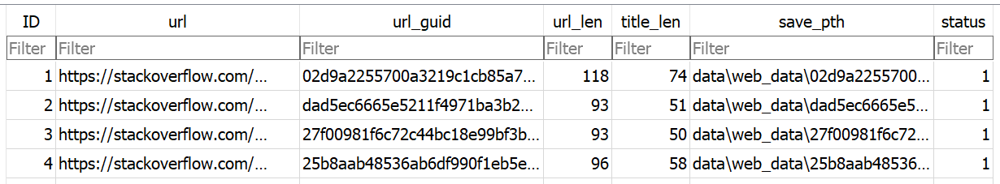

Title: Build a Search System
date: 2020-09-01 17:00
Author: Kent Chiu
Tags: Search, Recommendations

Recently I write a simple search system that mostly in python. ([Github Link](https://github.com/KentChun33333/search_eng)) This post is the introduction of it. 

### 1. Project Overall

Typically, search/recommend system would including several key components (1) Web Crawler (2) Indexing (3) Recall model/mechanism (4) Rank model (5) Query Web-Interface. 

#### 1.1 Web Crawler 

- Using *selenium* and *beautifulsoup4* to fetch the data from https://stackoverflow.com that mostly related to database. In addition, currently only crawling the title as document for storage concerns. This reop use *sqlite3* as forward-database for simplicity. 

  

  

#### 1.2 Indexing

- Using *nltk* and *gensim* to do the text normalization, stemming, lemmatization and doc2vec. 

- Using a customized object as inverted (index) database. For real applications, we can chose *leveldb*, *dynamodb* or *rockdb*. The customized object is basically a k-value object with the optimization that applies tire-tree on inverted index. 

  | index (key word) | Value                            |
  | ---------------- | -------------------------------- |
  | sql              | [ (doc_id, term_frequency), ...] |
  | database         | [ (doc_id, term_frequency), ...] |

- There are many advanced efficient index way, and for vector-database the indexing method often consisted of clustering and quantization methods.

#### 1.3 Recall Model / Mechanism

- Here using traditional bool-query.  It could be further enhance with term-frequency or even a model to recall the candidates.

  

#### 1.4 Ranking Model / Mechanism

- Here using Doc2Vec from *gensim*. The pretrained weight is from https://github.com/jhlau/doc2vec. 

- The idea is to recommend the item base on vector similarity after recall-model.

  

#### 1.5 Query Interface

- Using Flask and Jinja template with bootstrap UI framework. 

   

### 2. Usage Flow

- install the requirement packages 
- install chrome driver for selenium in data/web_driver
  - It should align with the config.py
- python **run_web_crawler.py** 
  - It would create a forward database and storing blob in local machine.
- python **run_model_indexer.py** 
  - It would run text normalization and then build the inverted-index object. 
- python **run_query_interface.py**
  - It would run a flask server on localhost:5000. 
- Config File 
  - forward_database = *r*'data/sqldb/example.db'
  - inverted_database = *r*'data/sqldb/inverted_key_word_db.pkl'
  - Doc2Vector300D_model_weight = *r*"data/model/doc2vec.bin"

### 3. Result Comparison

Current result just using traditional bool query, and not counting lots features like voting, user persona, content of question, and content of reply answers. 

| This Repo                     | Original Website            |
| ----------------------------- | --------------------------- |
|  |  |

### 4. Further Improvement 

- There are lots of things we could improve on and play with:
  - **Model-based recall mechanism**:  Personally, I also build the vectors database of title-text, however not index it yet for fast-read. There are some ways to index the dense-vector database via some clustering or quantization methods. I would like to try some of them after more understanding of them.  Also, I am not sure how much improvement would it bring to the overall performance.
  - **Stronger Ranking model**: There are many rooms to improve the ranking model, like taking extra-features into the model or using a better model.  
  - **Distributed Storage**: we definitely can shading the database, both on forward-database and inverted database.
  - **Crawling for more content**: Due to storage limitations, I treat the title of the document as entire document. However, we could also crawling and parsing content as well.
  - **Advanced Indexing method**: if the data is large, we may need to do some compression on index. In addition, for dense vector-based search/recommend system, we may need to using clustering/product quantization plus multi-index method to index the database. There are several famous method like Non-Orthogonal Inverted Multi-Index or IVFADC.
